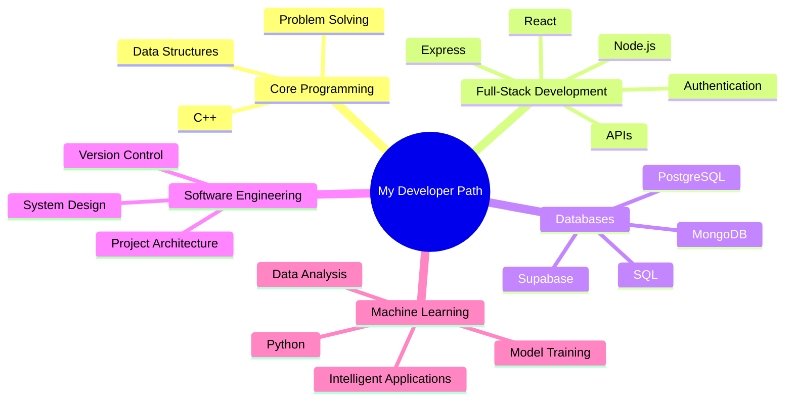

  

---

## 👋 About Me

Hi, I’m **Theo Mothuti**, a **4th-year Computer Science and Software Engineering student at Botswana International University of Science and Technology (BIUST)**.

I enjoy building practical software systems that solve real problems. My current focus is on **full-stack web development**, **database-driven applications**, and gradually moving into **Python and Machine Learning** so I can build smarter, more automated systems.

I am especially interested in:

- Project management and digital reporting
- Data organization and dashboards
- Workflow automation
- Database-backed business systems
- Intelligent tools powered by machine learning

---

## 🚀 Featured Portfolio Project

### 📊 Progress Tracker — Project Monitoring and Evaluation Platform

**Progress Tracker** is a full-stack project management and monitoring application designed for project managers and teams who need to track project activities, milestones, progress, finances, beneficiaries, challenges, reports, and presentations from one system.

The goal of this project is to help project managers move away from scattered spreadsheets and manual reporting by providing a cleaner digital platform for monitoring project implementation.

### Key Features

- Multi-project management
- Project dashboard overview
- Milestone and activity tracking
- Progress update recording
- Financial tracking
- Beneficiary tracking
- Challenge and mitigation tracking
- Spreadsheet import workflow
- Editable imported data review
- Reports and exports
- Email notification support for overdue tasks
- Full-screen **Presentation Mode** for project reporting

### Tech Used

---

## 🛠️ Languages and Tools

### My Current Stack

| Area | Technologies |
|---|---|
| **Programming** | C++, JavaScript, TypeScript, Python |
| **Frontend** | React, Vite, HTML, CSS, Tailwind CSS |
| **Backend** | Node.js, Express.js |
| **Databases** | SQL, PostgreSQL, MongoDB |
| **Cloud / Backend Services** | Supabase, Vercel |
| **Tools** | Git, GitHub, VS Code |
| **Currently Learning** | Python, Machine Learning, Data Science foundations |

---

## 🧠 Learning Path

---

## 📌 Portfolio Focus

I am building my portfolio around projects that show both technical skill and real-world usefulness.

| Project Area | What I Want to Demonstrate |
|---|---|
| **Full-Stack Applications** | Building complete systems from frontend to backend |
| **Database Systems** | Designing structured and scalable data models |
| **Dashboards and Reporting** | Turning raw data into useful insights |
| **Automation** | Reducing manual work through software |
| **Machine Learning** | Adding intelligent features to practical applications |

---

## 💡 What I’m Working Toward

I am working toward becoming a developer who can build complete systems that are:

- Reliable
- User-friendly
- Data-driven
- Scalable
- Useful in real-world environments
- Intelligent through automation and machine learning

My long-term goal is to combine **software engineering** and **machine learning** to build systems that help people work faster, make better decisions, and manage information more effectively.

---

## 🤝 Connect With Me

---

### “Building practical software today, learning intelligent systems for tomorrow.”

